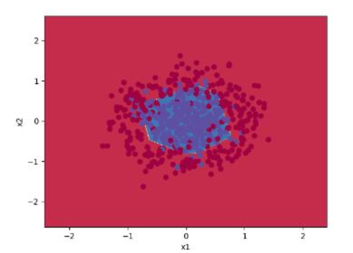

# MLP with Numpy
This repository Implemented a Neural Network from scratch with Numpy. All the forward and backward and activation function are calculated with numpy function and they're used for training phase. We can see classifciation decision boundary.

    

